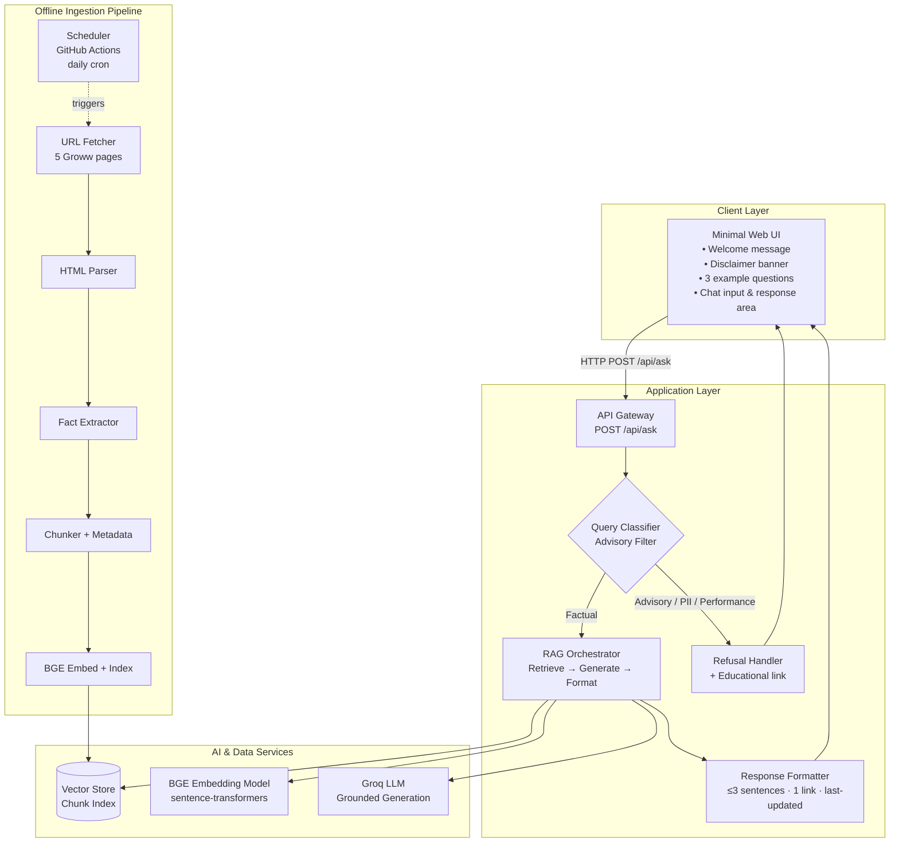
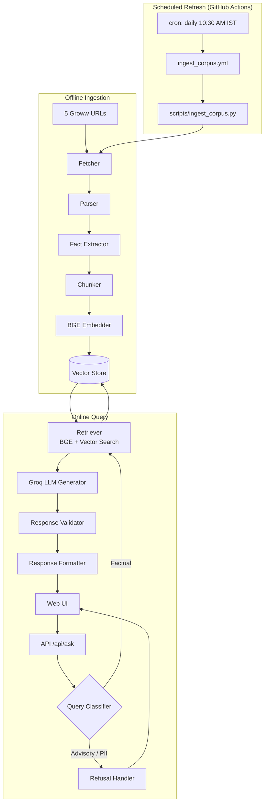

# Architecture: Mutual Fund FAQ Assistant (Facts-Only Q&A)

## 1. Document Purpose

This document defines the technical architecture for the **Mutual Fund FAQ Assistant** — a lightweight, compliance-first RAG system that answers factual questions about five HDFC Mutual Fund schemes using **only five Groww scheme page URLs** as its document corpus.

It is derived from [context.md](./context.md) and is intended to guide implementation, testing, and deployment decisions.

---

## 2. Architecture Goals

| Goal | Description |
|---|---|
| **Facts-only** | Answer objective, verifiable questions; refuse advisory or speculative queries |
| **Source-backed** | Every factual response includes exactly one citation URL and a last-updated date |
| **Concise** | Factual answers are limited to a maximum of 3 sentences |
| **Corpus-bound** | Retrieval is restricted to the five curated Groww scheme pages — no external documents in the RAG pipeline |
| **Privacy-safe** | No collection, storage, or processing of PII (PAN, Aadhaar, account numbers, OTPs, email, phone) |
| **Minimal UI** | Simple chat interface with welcome message, example questions, and a persistent disclaimer |
| **Transparent** | Clear refusal messages and explicit system limitations |

---

## 3. High-Level System Architecture



**Layer summary**

| Layer | Components | Role |
|---|---|---|
| **Client** | Minimal Web UI | User interaction, disclaimer, example questions, chat |
| **Application** | API, Classifier, RAG Orchestrator, Refusal Handler, Formatter | Route queries, enforce compliance, produce responses |
| **AI & Data** | Vector Store, BGE Embedding Model, Groq LLM | Semantic retrieval (local BGE) and grounded answer generation (Groq API) |
| **Offline** | Scheduler, Fetch → Parse → Extract → Chunk → Embed → Index | GitHub Actions triggers daily corpus refresh; batch pipeline builds the 5-URL Groww index |

---

## 4. Corpus Architecture

### 4.1 Corpus Scope

The RAG pipeline uses **exactly five URLs** — no supplementary AMC, AMFI, SEBI, CAMS, or KFintech documents are ingested.

| # | Scheme | Category | Corpus URL |
|---|---|---|---|
| 1 | HDFC Large Cap Fund – Direct Growth | Large Cap (Equity) | https://groww.in/mutual-funds/hdfc-large-cap-fund-direct-growth |
| 2 | HDFC Mid Cap Fund – Direct Growth | Mid Cap (Equity) | https://groww.in/mutual-funds/hdfc-mid-cap-fund-direct-growth |
| 3 | HDFC Small Cap Fund – Direct Growth | Small Cap (Equity) | https://groww.in/mutual-funds/hdfc-small-cap-fund-direct-growth |
| 4 | HDFC Gold ETF Fund of Fund – Direct Plan Growth | Commodity (Gold) | https://groww.in/mutual-funds/hdfc-gold-etf-fund-of-fund-direct-plan-growth |
| 5 | HDFC Silver ETF FoF – Direct Growth | Commodity (Silver) | https://groww.in/mutual-funds/hdfc-silver-etf-fof-direct-growth |

### 4.2 Extracted Data Points (Per Scheme)

Only factual fields displayed on Groww scheme pages are extracted and indexed:

| Field | Example Query |
|---|---|
| NAV (current) | "What is the NAV of HDFC Mid Cap Fund?" |
| Expense Ratio | "What is the expense ratio?" |
| Exit Load | "What is the exit load for HDFC Large Cap Fund?" |
| Minimum SIP Amount | "What is the minimum SIP?" |
| Riskometer Classification | "What is the risk level of this fund?" |
| Benchmark Index | "What is the benchmark index?" |
| Fund Manager(s) | "Who manages HDFC Small Cap Fund?" |
| AUM | "What is the AUM of this fund?" |
| Fund Category | "What category is HDFC Gold ETF FoF?" |
| Lock-in Period | "Is there a lock-in period?" (N/A for these schemes) |

### 4.3 Excluded Content (Not Indexed)

The ingestion pipeline must **explicitly filter out**:

- Groww editorial content, blog posts, and recommendations
- User reviews and ratings
- Performance charts, return calculators, and comparison tools
- Any advisory or opinion-based text
- Login-gated or subscription-only content

---

## 5. Component Architecture

### 5.1 Offline Ingestion Pipeline

Runs as a batch job (on setup and on periodic corpus refresh).

```
Corpus URLs (5)
      │
      ▼
┌─────────────┐
│ URL Fetcher │  HTTP GET with rate limiting; no authentication required
└──────┬──────┘
       ▼
┌─────────────┐
│ HTML Parser │  Extract structured factual sections from Groww page DOM/JSON
└──────┬──────┘
       ▼
┌─────────────┐
│ Fact        │  Normalize fields into a canonical schema per scheme
│ Extractor   │  Attach metadata: scheme_name, category, source_url, fetched_at
└──────┬──────┘
       ▼
┌─────────────┐
│ Chunker     │  Split into semantically meaningful chunks (field-level or
│             │  section-level); preserve source URL in every chunk
└──────┬──────┘
       ▼
┌─────────────┐
│ BGE         │  Generate vector embeddings for each chunk
│ Embedder    │  (BAAI/bge-small-en-v1.5 via sentence-transformers)
└──────┬──────┘
       ▼
┌─────────────┐
│ Vector      │  Persist chunks + embeddings + metadata
│ Index Writer│
└─────────────┘
```

### 5.1.1 Scheduler Component (GitHub Actions)

The ingestion pipeline is triggered on a **daily schedule** by a GitHub Actions workflow — not by the online API. This keeps corpus data fresh without coupling query latency to Groww fetches.

```
┌─────────────────────────────────────────────────────────────┐
│  GitHub Actions: .github/workflows/ingest_corpus.yml        │
│                                                             │
│  Triggers:                                                  │
│    • schedule: cron "0 5 * * *"  (daily, 10:30 AM IST / 05:00 UTC)       │
│    • workflow_dispatch  (manual on-demand refresh)          │
│                                                             │
│  Steps:                                                     │
│    checkout → setup Python → install deps → Playwright    │
│    → python scripts/ingest_corpus.py → validation gate      │
│    → upload artifacts (corpus_index, vector_store, logs)    │
│    → optional deploy sync to production host                │
└──────────────────────────┬──────────────────────────────────┘
                           │
                           ▼
              scripts/ingest_corpus.py  (Phase 2 CLI)
                           │
                           ▼
              Vector Store + corpus_index.json updated
```

| Concern | Design |
|---|---|
| **Separation of concerns** | Scheduler only orchestrates; all fetch/parse/embed logic stays in `ingestion/` and `scripts/ingest_corpus.py`. |
| **Runner choice** | `ubuntu-latest` for CI-style runs with artifact upload; **self-hosted runner** on the deployment VM when the API reads a local `VECTOR_STORE_PATH` and artifacts are unnecessary. |
| **Failure handling** | Workflow fails if ingestion validation does not report 5/5 schemes; failed runs must not silently deploy a partial index. |
| **API freshness** | Backend loads the vector store at startup; after a successful scheduled run, restart the API (or reload) so `last_updated` footers reflect new `fetched_at` values. |
| **Secrets** | Ingestion requires no API keys; `GROQ_API_KEY` is not used in the scheduler job. |
| **Audit** | Actions run logs + `logs/ingestion_run.log` artifact provide per-scheme field coverage and error history. |

**Chunk metadata schema (per chunk):**

```json
{
  "chunk_id": "hdfc-large-cap-expense-ratio",
  "scheme_name": "HDFC Large Cap Fund – Direct Growth",
  "scheme_slug": "hdfc-large-cap-fund-direct-growth",
  "category": "Large Cap (Equity)",
  "field": "expense_ratio",
  "content": "Expense ratio: 0.96% (Direct Plan – Growth)",
  "source_url": "https://groww.in/mutual-funds/hdfc-large-cap-fund-direct-growth",
  "fetched_at": "2026-06-28T00:00:00Z"
}
```

### 5.2 Query Classification Layer

Runs **before** retrieval to enforce facts-only compliance.

```
User Query
    │
    ▼
┌──────────────────────────────────────────────┐
│ Query Classifier                             │
│                                              │
│ 1. Rule-based keyword/pattern matching       │
│    (advice, recommend, better, should I,     │
│     compare returns, safe fund, etc.)        │
│                                              │
│ 2. Optional Groq LLM intent classification │
│    (factual | advisory | performance)      │
│                                              │
│ 3. PII detection guard                       │
│    (PAN, Aadhaar, account, OTP, email, phone)│
└──────────────────┬───────────────────────────┘
                   │
         ┌─────────┴─────────┐
         ▼                   ▼
    ADVISORY / PII      FACTUAL
         │                   │
         ▼                   ▼
  Refusal Handler      RAG Orchestrator
```

**Classification outcomes:**

| Outcome | Trigger Examples | Action |
|---|---|---|
| `FACTUAL` | "What is the exit load?", "Minimum SIP amount?" | Proceed to retrieval |
| `ADVISORY` | "Should I invest?", "Which fund is better?" | Refusal + educational link |
| `PERFORMANCE` | "What are the returns?", "Compare Fund A vs B" | Refusal or link-only response (no quoted returns) |
| `PII_DETECTED` | Query contains PAN, phone, etc. | Refuse; do not store query |
| `OUT_OF_SCOPE` | Query about schemes not in corpus | Polite "not in corpus" response |

### 5.3 Retrieval Layer

```
User Query (factual)
      │
      ▼
┌─────────────┐
│ BGE Query   │  Embed user question into vector space
│ Embedder    │  (same BGE model as ingestion)
└──────┬──────┘
       ▼
┌─────────────┐
│ Vector      │  Top-k similarity search (k = 3–5)
│ Search      │  Filter: only chunks from 5 Groww URLs
└──────┬──────┘
       ▼
┌─────────────┐
│ Re-ranker   │  Optional: boost chunks matching scheme name
│ (optional)  │  mentioned in query; prefer field-level matches
└──────┬──────┘
       ▼
Retrieved Chunks + Metadata (source_url, fetched_at)
```

**Retrieval constraints:**

- Search space is limited to the five indexed Groww pages
- Every retrieved chunk carries its `source_url` for citation
- If no chunk exceeds a similarity threshold, return a graceful "information not found in corpus" response rather than hallucinating

### 5.4 Generation Layer

```
Retrieved Chunks
      │
      ▼
┌─────────────────────────────────────────────┐
│ Groq LLM Prompt Assembly                    │
│                                             │
│ System prompt:                              │
│   • Facts-only; no advice or opinions       │
│   • Max 3 sentences                         │
│   • Use only provided context               │
│   • Do not quote historical returns         │
│                                             │
│ Context: retrieved chunks                   │
│ User query: original question               │
└──────────────────┬──────────────────────────┘
                   ▼
┌─────────────────────────────────────────────┐
│ Groq LLM Generation                         │
│ (via Groq API — e.g. llama-3.3-70b-versatile)│
└──────────────────┬──────────────────────────┘
                   ▼
┌─────────────────────────────────────────────┐
│ Response Validator                          │
│   • ≤ 3 sentences                           │
│   • No advisory language                    │
│   • Grounded in retrieved context           │
│   • Performance query → link-only fallback  │
└──────────────────┬──────────────────────────┘
                   ▼
            Validated Answer Text
```

### 5.5 Response Formatter (Citation Layer)

Assembles the final user-facing response:

```
<Answer body — 1 to 3 sentences>

Source: <single Groww scheme page URL>
Last updated from sources: <date from chunk fetched_at>
```

**Citation rules:**

- Exactly **one** source link per response
- Link must be one of the five corpus URLs
- If multiple schemes are referenced, cite the most relevant scheme page
- `Last updated from sources` date is derived from the `fetched_at` timestamp of the source chunk(s)

### 5.6 Refusal Handler

For advisory, performance-comparison, or PII-containing queries:

```
I can only provide factual information about mutual fund schemes and cannot offer investment advice or recommendations.
For guidance on evaluating mutual funds, please refer to: <AMFI or SEBI educational link>
```

Refusal responses do **not** invoke the RAG pipeline. Educational links (AMFI/SEBI) are used only in refusal messages — they are **not** part of the indexed corpus.

---

## 6. End-to-End Request Flow

### 6.1 Factual Query Flow

```
User: "What is the exit load for HDFC Large Cap Fund?"
  │
  ├─► UI sends POST /api/ask { "query": "..." }
  │
  ├─► API validates input (length, no PII)
  │
  ├─► Query Classifier → FACTUAL
  │
  ├─► Embed query → Vector search → Top chunks retrieved
  │     (chunk: exit_load for hdfc-large-cap-fund-direct-growth)
  │
  ├─► Groq LLM generates answer from retrieved context
  │
  ├─► Response Validator checks ≤3 sentences, no advice
  │
  ├─► Response Formatter attaches:
  │     Source: https://groww.in/mutual-funds/hdfc-large-cap-fund-direct-growth
  │     Last updated from sources: June 2026
  │
  └─► UI renders answer + source link + footer
```

### 6.2 Advisory Query Flow

```
User: "Should I invest in HDFC Mid Cap Fund?"
  │
  ├─► Query Classifier → ADVISORY
  │
  ├─► Refusal Handler returns polite refusal + AMFI/SEBI link
  │
  └─► UI renders refusal (no RAG retrieval or Groq generation)
```

### 6.3 Performance Query Flow

```
User: "What are the 1-year returns of HDFC Small Cap Fund?"
  │
  ├─► Query Classifier → PERFORMANCE
  │
  ├─► No return figures quoted
  │
  └─► Response: link to the scheme's Groww page only
        Source: https://groww.in/mutual-funds/hdfc-small-cap-fund-direct-growth
```

---

## 7. UI Architecture

### 7.1 Layout

```
┌────────────────────────────────────────────────────────┐
│  Mutual Fund FAQ Assistant                             │
│  ┌──────────────────────────────────────────────────┐  │
│  │  ⚠ Facts-only. No investment advice.             │  │
│  └──────────────────────────────────────────────────┘  │
│                                                        │
│  Welcome message:                                      │
│  "Ask factual questions about five HDFC mutual fund    │
│   schemes. I provide source-backed answers only."      │
│                                                        │
│  Try asking:                                           │
│  [ What is the expense ratio of HDFC Large Cap Fund? ] │
│  [ What is the minimum SIP for HDFC Mid Cap Fund?   ]  │
│  [ What is the riskometer for HDFC Gold ETF FoF?    ]  │
│                                                        │
│  ┌──────────────────────────────────────────────────┐  │
│  │  Chat history / response area                    │  │
│  │  • Answer text                                   │  │
│  │  • Source link (clickable)                       │  │
│  │  • Last updated from sources: <date>             │  │
│  └──────────────────────────────────────────────────┘  │
│                                                        │
│  [ Type your question...                    ] [ Ask ]  │
└────────────────────────────────────────────────────────┘
```

### 7.2 UI Components

| Component | Responsibility |
|---|---|
| `DisclaimerBanner` | Always-visible "Facts-only. No investment advice." |
| `WelcomeMessage` | Explains purpose and limitations on first load |
| `ExampleQuestions` | 3 clickable chips that populate the input field |
| `ChatInput` | Single-line or multi-line text input; no PII fields |
| `ResponseCard` | Renders answer, source link, and last-updated footer |
| `RefusalCard` | Renders advisory refusal with educational link |

### 7.3 Frontend–Backend Contract

**Request:**

```http
POST /api/ask
Content-Type: application/json

{
  "query": "What is the exit load for HDFC Large Cap Fund?"
}
```

**Response (factual):**

```json
{
  "type": "answer",
  "answer": "The exit load for HDFC Large Cap Fund is 1% if redeemed within 1 year from the date of allotment. No exit load applies after 1 year.",
  "source_url": "https://groww.in/mutual-funds/hdfc-large-cap-fund-direct-growth",
  "last_updated": "June 2026"
}
```

**Response (refusal):**

```json
{
  "type": "refusal",
  "message": "I can only provide factual information about mutual fund schemes and cannot offer investment advice or recommendations.",
  "educational_url": "https://www.amfiindia.com/investor-corner/knowledge-center"
}
```

---

## 8. Compliance Architecture

Compliance is enforced at multiple layers — not only in the Groq LLM prompt.

```
┌─────────────────────────────────────────────────────────┐
│                  COMPLIANCE ENFORCEMENT                  │
├─────────────────────────────────────────────────────────┤
│ Layer 1: Corpus Boundary                                │
│   • Only 5 Groww URLs ingested                          │
│   • Editorial/advisory content filtered at ingestion    │
├─────────────────────────────────────────────────────────┤
│ Layer 2: Input Guard                                    │
│   • PII detection on user query                         │
│   • Query length limits                                 │
├─────────────────────────────────────────────────────────┤
│ Layer 3: Query Classifier                               │
│   • Advisory/performance intent blocked before RAG      │
├─────────────────────────────────────────────────────────┤
│ Layer 4: Retrieval Constraint                           │
│   • Search limited to indexed corpus chunks             │
├─────────────────────────────────────────────────────────┤
│ Layer 5: Generation Prompt                                │
│   • Facts-only system instructions                      │
│   • Context-only grounding                              │
├─────────────────────────────────────────────────────────┤
│ Layer 6: Response Validator                             │
│   • ≤ 3 sentences                                       │
│   • No advisory language                                │
│   • Exactly 1 citation URL                              │
│   • Performance queries → link-only                     │
├─────────────────────────────────────────────────────────┤
│ Layer 7: UI Disclaimer                                  │
│   • Persistent "Facts-only. No investment advice."      │
└─────────────────────────────────────────────────────────┘
```

---

## 9. Recommended Technology Stack

The stack is intentionally lightweight for an MVP.

| Layer | Recommended Options | Rationale |
|---|---|---|
| **Frontend** | React / Next.js or plain HTML+JS | Minimal chat UI; fast to build |
| **Backend API** | Python (FastAPI) or Node.js (Express) | Simple REST endpoint for `/api/ask` |
| **HTML Fetching** | `httpx` / `requests` + `BeautifulSoup` or Playwright | Groww pages may require JS rendering |
| **Chunking** | Custom field-based chunker | Small, structured corpus; field-level chunks work well |
| **Embeddings** | **BGE** (`BAAI/bge-small-en-v1.5`) via `sentence-transformers` | Local, cost-free semantic search; no OpenAI dependency |
| **Vector Store** | ChromaDB / FAISS (local) | Lightweight for 5-page corpus |
| **LLM** | **Groq API** (e.g. `llama-3.3-70b-versatile`) | Fast inference for grounded generation with strict prompts |
| **Classifier** | Rule-based + optional lightweight Groq call | Advisory detection before retrieval |
| **Config** | `.env` for `GROQ_API_KEY` | No secrets in source code |
| **Scheduler** | GitHub Actions (`schedule` + `workflow_dispatch`) | Daily corpus refresh without in-app cron; version-controlled, auditable |

### 9.1 AI Model Choices

| Role | Model | Provider / Library | Notes |
|---|---|---|---|
| **Embeddings (ingestion + retrieval)** | `BAAI/bge-small-en-v1.5` | `sentence-transformers` (local) | Same model used for indexing and query embedding; runs offline on the server |
| **Text generation** | `llama-3.3-70b-versatile` (or equivalent Groq-hosted model) | Groq API | Powers factual answer generation and optional intent classification |
| **Vector similarity** | Cosine similarity on BGE vectors | ChromaDB / FAISS | Top-k retrieval over indexed Groww page chunks |

**Integration summary:**

```
Ingestion:  Groww HTML → chunks → BGE embeddings → Vector Store
Query:      User question → BGE embedding → Vector search → Groq LLM → formatted response
```

---

## 10. Project Module Structure

```
mutual-fund-faq-assistant/
├── Docs/
│   ├── context.md
│   ├── architecture.md
│   └── Problem_Statement_txt
├── data/
│   └── corpus_index.json          # 5 URLs, scheme metadata, fetch dates
├── ingestion/
│   ├── fetcher.py                 # HTTP fetch for Groww pages
│   ├── parser.py                  # HTML/JSON extraction
│   ├── extractor.py               # Normalize factual fields
│   ├── chunker.py                 # Field-level chunking + metadata
│   └── indexer.py                 # BGE embed and write to vector store
├── rag/
│   ├── classifier.py              # Advisory / factual / performance / PII
│   ├── retriever.py               # BGE query embedding + vector search
│   ├── generator.py               # Groq LLM prompt + generation
│   ├── validator.py               # Response compliance checks
│   └── formatter.py               # Citation + last-updated footer
├── api/
│   ├── main.py                    # FastAPI app
│   └── routes/
│       └── ask.py                 # POST /api/ask
├── ui/
│   ├── index.html                 # Or React app
│   └── components/
│       ├── DisclaimerBanner.tsx
│       ├── ExampleQuestions.tsx
│       ├── ChatInput.tsx
│       └── ResponseCard.tsx
├── scripts/
│   └── ingest_corpus.py           # Batch ingestion CLI (also invoked by scheduler)
├── .github/
│   └── workflows/
│       └── ingest_corpus.yml      # Daily scheduled corpus refresh (Phase 5.a)
├── tests/
│   ├── test_classifier.py
│   ├── test_retriever.py
│   ├── test_formatter.py
│   ├── test_compliance.py
│   └── test_scheduler_workflow.py # Workflow YAML structure smoke tests
├── .env.example                   # GROQ_API_KEY, BGE model name
└── README.md
```

---

## 11. Data Flow Diagram (Mermaid)



---

## 12. Deployment Architecture

### 12.1 MVP (Local / Single Server)

```
┌──────────────────────────────────────────┐
│  Developer Machine / Single VM           │
│                                          │
│  ┌────────────┐    ┌─────────────────┐  │
│  │ Static UI  │    │ FastAPI Backend │  │
│  │ (port 3000)│───►│ (port 8000)     │  │
│  └────────────┘    │  ├─ Classifier  │  │
│                      │  ├─ Retriever   │  │
│                      │  │   (BGE)      │  │
│                      │  └─ Generator   │  │
│                      │      (Groq API) │  │
│                      └────────┬────────┘  │
│                               │          │
│                      ┌────────▼────────┐  │
│                      │ ChromaDB / FAISS│  │
│                      │ + BGE vectors   │  │
│                      │ (local files)   │  │
│                      └─────────────────┘  │
│                                          │
│  External: Groq API (LLM inference)       │
└──────────────────────────────────────────┘
```

### 12.2 Corpus Refresh

Corpus refresh is automated via **GitHub Actions** (Phase 5.a) and can still be run manually.

| Mode | How | When |
|---|---|---|
| **Scheduled (primary)** | `.github/workflows/ingest_corpus.yml` cron (`0 5 * * *` UTC = 10:30 AM IST) | Daily automatic refresh |
| **Manual (CI)** | GitHub Actions → *Daily Corpus Ingestion* → *Run workflow* | On-demand before demos or after parser fixes |
| **Manual (local)** | `python scripts/ingest_corpus.py` | Development, debugging, or environments without Actions |

**Refresh flow:**

1. Scheduler workflow runs `scripts/ingest_corpus.py` on the runner.
2. Pipeline upserts chunks and updates `fetched_at` in `data/corpus_index.json`.
3. Artifacts (vector store, corpus index, logs) are uploaded for audit and deploy.
4. For production: sync artifacts to the host (or use a self-hosted runner that writes directly to `VECTOR_STORE_PATH`).
5. Restart the FastAPI backend so it loads the refreshed index; UI footers then show the new `last_updated` dates.

Until step 5 completes, the API continues serving the previous index (brief staleness is acceptable).

### 12.3 Scheduler Deployment Options

| Option | `runs-on` | Vector store update | Best for |
|---|---|---|---|
| **GitHub-hosted + artifacts** | `ubuntu-latest` | Download artifact and copy to server; restart API | Cloud deploy, audit trail |
| **Self-hosted runner** | `self-hosted` label on VM | Writes directly to local `VECTOR_STORE_PATH` | Single-server MVP |
| **Local cron (fallback)** | N/A | Same as manual CLI on the host | Air-gapped or no GitHub Actions |

See [implementation_plan.md](./implementation_plan.md) §8.6 for task breakdown and exit criteria.

---

## 13. Security and Privacy

| Concern | Mitigation |
|---|---|
| PII in user input | Regex/NER guard on query; reject and do not log PII |
| PII storage | No user accounts, no query persistence in MVP |
| API keys | `GROQ_API_KEY` stored in environment variables only; BGE runs locally (no embedding API key) |
| Corpus tampering | Corpus URLs are hardcoded/configured; not user-supplied |
| Prompt injection | Classifier + system prompt hardening; context-only answers |
| Rate limiting | Basic rate limit on `/api/ask` to prevent abuse |
| HTTPS | Use HTTPS in production deployments |

---

## 14. Error Handling

| Scenario | System Behavior |
|---|---|
| Groww page unreachable during ingestion | Log error; skip scheme; flag in corpus_index.json |
| No retrieval match above threshold | Return "I could not find this information in the available scheme pages." |
| Groq API timeout or failure | Return generic error; do not fabricate an answer |
| Advisory query detected | Refusal path; no retrieval |
| Query about unknown scheme | Out-of-scope message listing the five supported schemes |
| PII detected in query | Refuse politely; do not process or store |

---

## 15. Testing Strategy

| Test Type | Focus |
|---|---|
| **Unit** | Classifier rules, formatter output, chunk metadata schema |
| **Integration** | End-to-end `/api/ask` for factual and advisory queries |
| **Compliance** | Verify ≤3 sentences, exactly 1 citation, no advice language |
| **Retrieval** | Correct scheme chunk returned for scheme-specific queries |
| **Refusal** | All advisory query patterns consistently refused |
| **Corpus boundary** | Confirm no data retrieved outside 5 Groww URLs |

**Example compliance test cases:**

| Input | Expected Outcome |
|---|---|
| "What is the expense ratio of HDFC Large Cap Fund?" | Factual answer + Groww URL citation |
| "Should I invest in HDFC Mid Cap Fund?" | Refusal + educational link |
| "Compare returns of Large Cap vs Small Cap" | Refusal or link-only; no quoted returns |
| "My PAN is ABCDE1234F, check my fund" | PII refusal |

---

## 16. Known Limitations

| Limitation | Architectural Implication |
|---|---|
| Static corpus (5 Groww pages) | Daily GitHub Actions scheduler (Phase 5.a) refreshes data; answers reflect last successful ingestion |
| No real-time NAV | NAV answers reflect last ingestion date; UI should not imply live data |
| Single AMC, 5 schemes | Classifier should detect out-of-scope scheme queries |
| English only | No multilingual embedding or generation in MVP |
| No account integration | No portfolio, statement, or tax document query support |
| Groww page structure changes | Parser may break; ingestion pipeline needs monitoring |

---

## 17. Success Criteria (Architecture Alignment)

| Criterion | Architectural Mechanism |
|---|---|
| Factual accuracy | Retrieval-grounded generation from indexed Groww fields |
| Citation compliance | Response Formatter enforces exactly 1 source URL |
| Refusal accuracy | Query Classifier runs before retrieval |
| Response length | Response Validator enforces ≤ 3 sentences |
| UI usability | Disclaimer, welcome, and 3 example questions always visible |
| Privacy compliance | PII guard at input; no persistent user data store |

---

## 18. Future Extensions (Out of Scope for MVP)

- Change-detection alerts when Groww page structure shifts (ingestion warnings → notify)
- Admin dashboard for ingestion status and corpus health
- Multi-language support
- Additional AMCs or schemes (requires corpus expansion policy)
- Confidence scoring on retrieved answers
- Analytics on query types (advisory vs factual) without storing PII

---

*This architecture document is aligned with [context.md](./context.md) and defines the technical blueprint for building the Mutual Fund FAQ Assistant.*
