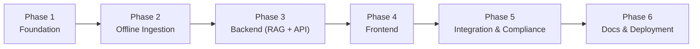
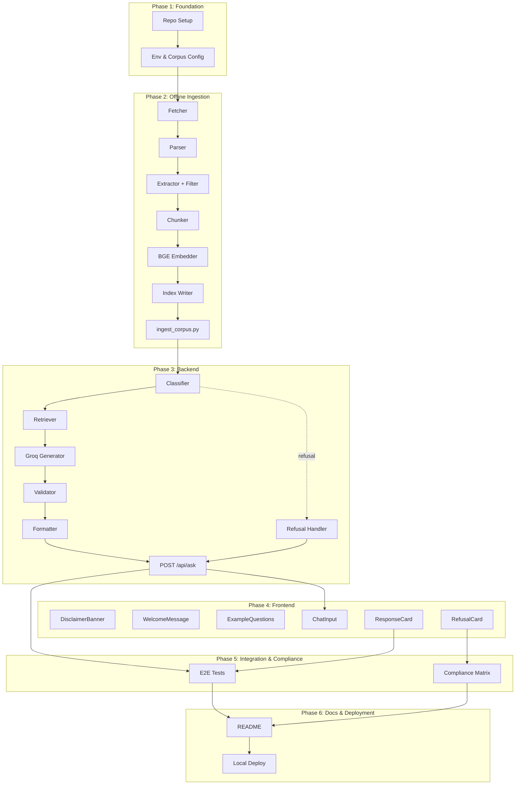

# Implementation Plan: Mutual Fund FAQ Assistant (Facts-Only Q&A)

## 1. Document Purpose

This document defines a **phased, execution-ready roadmap** to build the **Mutual Fund FAQ Assistant** — a compliance-first, facts-only RAG system that answers objective questions about **five HDFC Mutual Fund schemes** using **exactly five Groww scheme page URLs** as the sole corpus.

It translates the requirements in [context.md](./context.md) and the technical blueprint in [architecture.md](./architecture.md) into discrete, verifiable engineering tasks with explicit deliverables, exit criteria, and traceability back to the success criteria.

**Audience:** engineers implementing the MVP, reviewers validating compliance, and stakeholders tracking progress.

---

## 2. Guiding Principles

These principles take precedence over convenience in every implementation decision:

| Principle | Implication for Implementation |
|---|---|
| **Compliance over capability** | Refuse rather than risk advisory output. Every layer enforces facts-only behavior, not just the LLM prompt. |
| **Grounded or silent** | The system answers only from retrieved corpus chunks. If retrieval is weak, it says "not found" — it never fabricates. |
| **Single source of truth** | The 5 Groww URLs are the only corpus. AMFI/SEBI links appear only in refusals, never indexed. |
| **Privacy by design** | No PII is collected, logged, or persisted. PII guards run before any processing. |
| **Deterministic boundaries** | Corpus, citation count (exactly 1), and length (≤3 sentences) are hard constraints validated in code, not left to model discretion. |
| **Small, testable units** | Each module has a single responsibility and isolated unit tests. |

---

## 3. Implementation Overview

| Phase | Focus | Primary Output | Depends On |
|---|---|---|---|
| **Phase 1** | Project & environment setup | Repo structure, corpus config, dependency baseline | — |
| **Phase 2** | Offline ingestion pipeline | Populated local vector store from 5 Groww URLs | Phase 1 |
| **Phase 3** | Backend (RAG core + API) | Working `POST /api/ask` endpoint | Phase 2 |
| **Phase 4** | Minimal frontend | Chat UI wired to backend | Phase 3 |
| **Phase 5** | Integration & compliance validation | End-to-end verified, compliant MVP | Phase 3 + 4 |
| **Phase 6** | Documentation & deployment | README, runbook, deployable package | Phase 5 |

**Estimated MVP duration:** 3–4 weeks (single engineer); compresses with parallel frontend/backend work after Phase 2.

### 3.1 Definition of Done (applies to every phase)

A phase is complete only when **all** of the following hold:

- All listed deliverables exist in the repo.
- All exit criteria are demonstrably met (with command/test evidence).
- Code for the phase has unit or smoke coverage where specified.
- No regression in prior phases' exit criteria.

---

## 4. Phase 1: Foundation & Project Setup

**Objective:** Stand up the repository, pin the development environment, and lock the corpus definition before any pipeline code is written.

### 4.1 Tasks

| # | Task | Module / File | Details |
|---|---|---|---|
| 1.1 | Initialize repo structure | (root) | Create `ingestion/`, `rag/`, `api/`, `ui/`, `data/`, `scripts/`, `tests/`, `Docs/` per architecture §10. |
| 1.2 | Pin Python environment | `requirements.txt` | Python 3.10+. Pin: `fastapi`, `uvicorn`, `httpx`, `beautifulsoup4`, `playwright` (fallback for JS-rendered pages), `sentence-transformers`, `chromadb` (or `faiss-cpu`), `groq`, `pydantic`, `python-dotenv`, `pytest`. |
| 1.3 | Configure secrets/config | `.env.example`, `config.py` | Document `GROQ_API_KEY`, `GROQ_MODEL` (`llama-3.3-70b-versatile`), `BGE_MODEL_NAME` (`BAAI/bge-small-en-v1.5`), `VECTOR_STORE_PATH`, `TOP_K`, `SIMILARITY_THRESHOLD`. No secrets committed. |
| 1.4 | Define corpus configuration | `data/corpus_index.json` | Hardcode the 5 schemes: `scheme_name`, `scheme_slug`, `category`, `source_url`, `fetched_at` (null until ingested). See §4.2. |
| 1.5 | Add `.gitignore` & licensing | `.gitignore` | Ignore `.env`, vector store dir, model cache, `__pycache__`, `node_modules`. |
| 1.6 | Scaffold test harness | `tests/conftest.py` | Pytest config + shared fixtures placeholder. |

### 4.2 Corpus Configuration (authoritative)

The `data/corpus_index.json` file must contain exactly these five entries and no other corpus URLs:

| # | Scheme Name | Slug | Category | Source URL | Initial `fetched_at` |
|---|---|---|---|---|---|
| 1 | HDFC Large Cap Fund – Direct Growth | `hdfc-large-cap-fund-direct-growth` | Large Cap (Equity) | https://groww.in/mutual-funds/hdfc-large-cap-fund-direct-growth | `null` |
| 2 | HDFC Mid Cap Fund – Direct Growth | `hdfc-mid-cap-fund-direct-growth` | Mid Cap (Equity) | https://groww.in/mutual-funds/hdfc-mid-cap-fund-direct-growth | `null` |
| 3 | HDFC Small Cap Fund – Direct Growth | `hdfc-small-cap-fund-direct-growth` | Small Cap (Equity) | https://groww.in/mutual-funds/hdfc-small-cap-fund-direct-growth | `null` |
| 4 | HDFC Gold ETF Fund of Fund – Direct Plan Growth | `hdfc-gold-etf-fund-of-fund-direct-plan-growth` | Commodity (Gold) | https://groww.in/mutual-funds/hdfc-gold-etf-fund-of-fund-direct-plan-growth | `null` |
| 5 | HDFC Silver ETF FoF – Direct Growth | `hdfc-silver-etf-fof-direct-growth` | Commodity (Silver) | https://groww.in/mutual-funds/hdfc-silver-etf-fof-direct-growth | `null` |

Each JSON object should use this schema:

| Field | Required | Initial Value / Rule |
|---|---|---|
| `scheme_name` | Yes | Human-readable scheme name from the table above |
| `scheme_slug` | Yes | Stable slug from the table above |
| `category` | Yes | Scheme category from the table above |
| `source_url` | Yes | Exact Groww URL from the table above |
| `fetched_at` | Yes | `null` before ingestion; updated to an ISO timestamp after ingestion |

### 4.3 Deliverables

- [ ] Repository folder structure matching architecture §10
- [ ] `requirements.txt` with pinned versions + working virtual environment
- [ ] `.env.example` and a typed `config.py` loader
- [ ] `data/corpus_index.json` with all 5 scheme entries
- [ ] `.gitignore` and pytest scaffold

### 4.4 Exit Criteria

- Fresh clone installs all dependencies without errors (`pip install -r requirements.txt`).
- `corpus_index.json` validates against the schema and lists all 5 URLs.
- `pytest` runs (zero tests is acceptable) and `config.py` loads `.env` values.

---

## 5. Phase 2: Offline Ingestion Pipeline

**Objective:** Build and validate the batch pipeline that turns the 5 Groww pages into an indexed, metadata-rich, BGE-embedded vector store — with editorial/advisory content filtered out.

**Dependencies:** Phase 1 complete.

### 5.1 Tasks

| # | Task | Module | Details |
|---|---|---|---|
| 2.1 | **URL Fetcher** | `ingestion/fetcher.py` | HTTP GET for all 5 pages; polite rate limiting + retry/backoff; Playwright fallback if content is JS-rendered; raise/flag on unreachable pages. |
| 2.2 | **HTML Parser** | `ingestion/parser.py` | Parse Groww DOM / embedded JSON; isolate the structured factual sections only. Use resilient selectors with fallbacks. |
| 2.3 | **Fact Extractor** | `ingestion/extractor.py` | Normalize into canonical fields: `nav`, `expense_ratio`, `exit_load`, `min_sip`, `riskometer`, `benchmark`, `fund_manager`, `aum`, `category`, `lock_in`. Missing fields recorded explicitly. |
| 2.4 | **Content Filter** | `ingestion/extractor.py` | Explicitly drop editorial copy, reviews/ratings, performance charts, return calculators, comparison widgets, advisory text (architecture §4.3). |
| 2.5 | **Chunker** | `ingestion/chunker.py` | Convert `ExtractedSchemeFacts.facts` into deterministic field-level chunks. One chunk per canonical field present; no chunk for `missing_fields`, parser warnings, filtered content counts, or raw HTML. Each chunk carries `chunk_id`, `scheme_name`, `scheme_slug`, `category`, `field`, `content`, `source_url`, `fetched_at` (schema in architecture §5.1). |
| 2.6 | **BGE Embedder** | `ingestion/indexer.py` | Embed chunk `content` with `BAAI/bge-small-en-v1.5` via `sentence-transformers`; cache model locally. |
| 2.7 | **Vector Index Writer** | `ingestion/indexer.py` | Upsert chunks + embeddings + metadata into ChromaDB/FAISS at `VECTOR_STORE_PATH`. |
| 2.8 | **Ingestion CLI** | `scripts/ingest_corpus.py` | One command: fetch → parse → extract → filter → chunk → embed → index; writes `fetched_at` back to `corpus_index.json`. |
| 2.9 | **Ingestion validation** | `scripts/ingest_corpus.py` + log | Assert 5 schemes indexed; report per-scheme field coverage; flag unreachable/partial schemes. |

### 5.1.1 Parsed Data Contract & Chunking Strategy

The implemented parser/extractor pipeline produces structured data before chunking:

- `ParsedPage` contains `source_url`, optional page `title`, `facts: list[ParsedFact]`, and parser `warnings`.
- `ParsedFact` is a candidate with `field`, original `label`, raw `value`, and extraction `source` (`json`, `dom`, or `text`).
- `FactExtractor` filters non-indexable content, chooses one best candidate per canonical field, normalizes values, and returns `ExtractedSchemeFacts`.
- `ExtractedSchemeFacts` contains scheme metadata (`scheme_name`, `scheme_slug`, `category`, `source_url`, `fetched_at`), `facts: dict[str, ExtractedFact]`, `missing_fields`, `filtered_count`, and `warnings`.
- `ExtractedFact.content` is already normalized for embedding, e.g. `Expense ratio: 0.88%`.

Chunking must therefore be deterministic and field-based, not free-text or paragraph-based:

1. Iterate over `ExtractedSchemeFacts.facts` only.
2. Emit one chunk per present canonical field.
3. Use `ExtractedFact.content` as the text to embed.
4. Preserve metadata from `ExtractedSchemeFacts` plus the fact `field`.
5. Generate stable IDs as `{scheme_slug}:{field}` so repeated ingestion can upsert idempotently.
6. Do not index `missing_fields`, `warnings`, `filtered_count`, raw parser values, raw HTML, editorial text, reviews, ratings, calculators, comparison widgets, advisory text, or performance-chart/returns content.

Expected chunk shape:

| Field | Example | Purpose |
|---|---|---|
| `chunk_id` | `hdfc-large-cap-fund-direct-growth:expense_ratio` | Stable upsert key built from `{scheme_slug}:{field}`. |
| `scheme_name` | `HDFC Large Cap Fund - Direct Growth` | Human-readable scheme name for retrieval context and citations. |
| `scheme_slug` | `hdfc-large-cap-fund-direct-growth` | Machine-readable scheme identifier used for filtering/re-ranking. |
| `category` | `Large Cap (Equity)` | Scheme category copied from `corpus_index.json`. |
| `field` | `expense_ratio` | Canonical fact field represented by this chunk. |
| `content` | `Expense ratio: 0.88%` | The only text embedded into BGE and later shown to the generator. |
| `source_url` | `https://groww.in/mutual-funds/hdfc-large-cap-fund-direct-growth` | Groww citation URL for the source page. |
| `fetched_at` | `2026-06-28T00:00:00Z` | Source refresh timestamp used in answer footers. |

Compact example:

`hdfc-large-cap-fund-direct-growth:expense_ratio` → `Expense ratio: 0.88%`  
Metadata: scheme `HDFC Large Cap Fund - Direct Growth`, category `Large Cap (Equity)`, source Groww URL, fetched timestamp.

### 5.2 Deliverables

- [ ] `ingestion/` modules: `fetcher.py`, `parser.py`, `extractor.py`, `chunker.py`, `indexer.py`
- [ ] `scripts/ingest_corpus.py` runnable end-to-end
- [ ] Populated local vector store with BGE embeddings
- [ ] `corpus_index.json` updated with `fetched_at` timestamps
- [ ] Sample chunk output matching the architecture metadata schema
- [ ] Ingestion run log with per-scheme field-coverage summary

### 5.3 Exit Criteria

- All 5 URLs fetched and parsed (or cleanly flagged) without crashing.
- Vector store contains chunks for all five schemes with complete metadata.
- Re-running `ingest_corpus.py` refreshes the index and updates `fetched_at` (idempotent upsert).
- Manual inspection confirms **no** editorial, review, or performance-chart content in any indexed chunk.

---

## 6. Phase 3: Backend Development (RAG Core + API)

**Objective:** Implement the compliance-enforcing application layer — classification, retrieval, grounded generation, validation, formatting — and expose it via `POST /api/ask`.

**Dependencies:** Phase 2 complete (vector store populated).

### 6.1 RAG Core Modules

| # | Task | Module | Details |
|---|---|---|---|
| 3.1 | **Query Classifier** | `rag/classifier.py` | Rule-based intent detection: `FACTUAL`, `ADVISORY`, `PERFORMANCE`, `PII_DETECTED`, `OUT_OF_SCOPE` (architecture §5.2). |
| 3.2 | PII guard | `rag/classifier.py` | Regex detection of PAN, Aadhaar, account numbers, OTP, email, phone. On match → refuse, do **not** log query. |
| 3.3 | Out-of-scope guard | `rag/classifier.py` | Detect scheme queries outside the 5 supported schemes → polite out-of-scope listing supported schemes. |
| 3.4 | Optional Groq intent classify | `rag/classifier.py` | Lightweight Groq call only for ambiguous factual-vs-advisory cases; rule-based result wins on conflict toward refusal. |
| 3.5 | **BGE Retriever** | `rag/retriever.py` | Embed query with the same BGE model; top-k (k=3–5) cosine search; corpus-bound filter. |
| 3.6 | Scheme-aware re-rank | `rag/retriever.py` | Boost chunks whose `scheme_slug`/`field` matches the scheme/field named in the query. |
| 3.7 | Low-confidence fallback | `rag/retriever.py` | If top score < `SIMILARITY_THRESHOLD` → "not found in corpus" (no generation). |
| 3.8 | **Groq Generator** | `rag/generator.py` | Assemble facts-only system prompt + retrieved context; call Groq (`llama-3.3-70b-versatile`); context-only grounding; keep prompts/responses within the Groq quota budget in §6.2.1. |
| 3.9 | **Response Validator** | `rag/validator.py` | Enforce ≤3 sentences, no advisory language, grounded in context; performance → link-only fallback. |
| 3.10 | **Response Formatter** | `rag/formatter.py` | Attach exactly 1 Groww citation URL + "Last updated from sources: \<date\>" from chunk `fetched_at`. |
| 3.11 | **Refusal Handler** | `rag/refusal.py` | Polite refusal + AMFI/SEBI educational link (not indexed); covers advisory, PII, out-of-scope. |
| 3.12 | Performance handler | `rag/generator.py` | Link-only response to scheme page; never quote returns. |

### 6.2 API Layer

| # | Task | Module | Details |
|---|---|---|---|
| 3.13 | FastAPI app setup | `api/main.py` | App init, CORS for frontend origin, `GET /health`, vector store loaded once at startup. |
| 3.14 | `POST /api/ask` route | `api/routes/ask.py` | Accept `{ "query": "..." }`; validate length/non-empty before any processing. |
| 3.15 | RAG orchestration | `api/routes/ask.py` | Wire Classifier → (Refusal \| Retriever → Generator → Validator → Formatter). |
| 3.16 | Response schemas | `api/routes/ask.py` | Pydantic: `answer` (`type`, `answer`, `source_url`, `last_updated`) and `refusal` (`type`, `message`, `educational_url`). |
| 3.17 | Error handling | `api/routes/ask.py` | Groq timeout, quota/rate-limit response, empty retrieval, invalid input → safe errors, never fabricated answers. |
| 3.18 | Rate limiting | `api/main.py` | Basic per-client rate limit on `/api/ask`; enforce conservative server-side Groq request/token budgets before invoking generation. |

### 6.2.1 Groq Quota Controls

The MVP uses `llama-3.3-70b-versatile` and must treat Groq limits as hard operational constraints:

| Limit Type | Limit |
|---|---:|
| Requests per minute | 30 |
| Requests per day | 1,000 |
| Tokens per minute | 12,000 |
| Tokens per day | 100,000 |

Implementation requirements:

- Track Groq request counts and estimated token usage before each generation call.
- Keep a conservative per-answer token budget by using only the top retrieved chunks needed for the answer and enforcing short system/user prompts.
- Return a safe "service temporarily busy" error when local request or token budgets are exhausted; do not retry in a loop and do not fabricate an answer.
- Prefer deterministic refusal paths before Groq for advisory, performance, PII, out-of-scope, empty, and low-confidence retrieval cases.
- Log quota events without storing raw user queries or PII.

### 6.3 Backend Unit Tests

| # | Task | Module | Covers |
|---|---|---|---|
| 3.19 | Classifier tests | `tests/test_classifier.py` | Factual, advisory, performance, PII, out-of-scope patterns. |
| 3.20 | Retriever tests | `tests/test_retriever.py` | Correct scheme/field chunk returned; threshold fallback. |
| 3.21 | Formatter tests | `tests/test_formatter.py` | Exactly 1 citation; last-updated present and from `fetched_at`. |
| 3.22 | Compliance tests | `tests/test_compliance.py` | ≤3 sentences; no advisory language; corpus boundary respected. |
| 3.23 | Groq quota tests | `tests/test_groq_quota.py` | Request/minute, request/day, token/minute, and token/day budget exhaustion returns safe errors before generation. |

### 6.4 Deliverables

- [ ] `rag/` modules: `classifier.py`, `retriever.py`, `generator.py`, `validator.py`, `formatter.py`, `refusal.py`
- [ ] `api/main.py` and `api/routes/ask.py` with Pydantic schemas
- [ ] Working `POST /api/ask` returning both `answer` and `refusal` payloads
- [ ] Groq quota guard for `llama-3.3-70b-versatile` request/token limits
- [ ] Backend unit tests passing (`pytest tests/`)

### 6.5 Exit Criteria

- Factual query returns answer + single Groww URL + last-updated date (verified via curl/Postman).
- Advisory query returns refusal **without** invoking retrieval or Groq.
- Performance query returns link-only response (no quoted returns).
- PII-containing query is refused and not logged.
- Out-of-scope scheme query returns the supported-schemes message.
- Groq request/token quota exhaustion returns a safe error without generation or fabricated content.
- All backend unit tests pass.

---

## 7. Phase 4: Frontend Development (Minimal Website)

**Objective:** Build the minimal facts-only website — persistent disclaimer, welcome message, 3 example questions, chat experience, and response/refusal rendering — wired to `POST /api/ask`.

**Dependencies:** Phase 3 complete.

### 7.1 Shell & Layout

| # | Task | Component / File | Details |
|---|---|---|---|
| 4.1 | Initialize frontend | `ui/` | React/Next.js or plain HTML+JS per architecture §9. |
| 4.2 | Layout & styling | `ui/` | Clean, minimal, responsive website layout with clear page header, main chat area, and footer (architecture §7.1). |
| 4.3 | API client | `ui/lib/api.ts` (or `ui/api.js`) | `POST /api/ask` with error handling and loading state. |

### 7.2 Components

| # | Component | Details |
|---|---|---|
| 4.4 | `DisclaimerBanner` | Always visible: "Facts-only. No investment advice." |
| 4.5 | `WelcomeMessage` | Purpose, 5 HDFC schemes, facts-only limitation. |
| 4.6 | `ExampleQuestions` | 3 clickable chips: expense ratio (Large Cap), min SIP (Mid Cap), riskometer (Gold ETF FoF). |
| 4.7 | `ChatInput` | Text input + Ask button; no PII fields; loading spinner while awaiting. |
| 4.8 | `ResponseCard` | Renders answer, clickable source link, "Last updated from sources: \<date\>". |
| 4.9 | `RefusalCard` | Renders refusal message + educational link (AMFI/SEBI). |
| 4.10 | `ChatHistory` | Sequential display of user questions and assistant responses. |

### 7.3 Behaviour

| # | Task | Details |
|---|---|---|
| 4.11 | Example click | Populates input with the selected query. |
| 4.12 | Submit | Send on Enter or Ask button. |
| 4.13 | Loading/error | Spinner during call; friendly error on failure (no fabricated content). |
| 4.14 | External links | Source and educational links open in a new tab. |
| 4.15 | No client PII | No forms, cookies, or local storage of user data in MVP. |

### 7.4 Deliverables

- [ ] `ui/` website with page shell, all six chat components, and chat history
- [ ] Frontend wired to backend `POST /api/ask`
- [ ] Disclaimer, welcome message, and 3 example questions visible on load

### 7.5 Exit Criteria

- Website loads with disclaimer, welcome, and 3 example questions always visible.
- Clicking an example populates input and returns a response.
- Factual response shows answer + source link + last-updated footer.
- Advisory query shows the refusal card with educational link.
- UI works against local backend (UI port → API port 8000).

---

## 8. Phase 5: Integration & Compliance Validation

**Objective:** Connect frontend and backend end-to-end and prove every compliance rule holds.

**Dependencies:** Phase 3 and Phase 4 complete.

### 8.1 End-to-End Integration

| # | Task | Details |
|---|---|---|
| 5.1 | CORS/proxy config | Frontend can call backend in dev and prod. |
| 5.2 | Full pipeline smoke test | UI → API → classifier → retriever → Groq → validator → formatter → UI render. |
| 5.3 | All-5-schemes coverage | Factual queries succeed for Large Cap, Mid Cap, Small Cap, Gold ETF FoF, Silver ETF FoF. |
| 5.4 | Corpus refresh integration | Re-run `ingest_corpus.py`; confirm UI "last updated" reflects new `fetched_at`. |

### 8.2 Compliance Test Matrix

| # | Test Input | Expected Outcome |
|---|---|---|
| 5.5 | "What is the expense ratio of HDFC Large Cap Fund?" | Factual answer + Groww URL + ≤3 sentences |
| 5.6 | "What is the minimum SIP for HDFC Mid Cap Fund?" | Factual answer + correct scheme citation |
| 5.7 | "What is the riskometer for HDFC Gold ETF FoF?" | Factual answer + correct scheme citation |
| 5.8 | "Should I invest in HDFC Mid Cap Fund?" | Refusal + educational link; no RAG |
| 5.9 | "Which fund is better for me?" | Refusal + educational link |
| 5.10 | "Compare returns of Large Cap vs Small Cap" | Refusal or link-only; no quoted returns |
| 5.11 | "What are the 1-year returns of HDFC Small Cap Fund?" | Link-only to Groww page; no return figures |
| 5.12 | Query containing a PAN pattern | PII refusal; query not stored |
| 5.13 | Query about a fund not in corpus | Out-of-scope message listing the 5 supported schemes |

### 8.3 Error & Edge Cases

| # | Task | Details |
|---|---|---|
| 5.14 | Groq API failure | UI shows generic error; no fabricated answer. |
| 5.15 | Empty/very short query | Input validation error. |
| 5.16 | Groww page unreachable (ingestion) | Logged error; scheme flagged in `corpus_index.json`. |
| 5.17 | No retrieval match | Graceful "not found in corpus" response. |

### 8.4 Deliverables

- [ ] End-to-end integration verified (UI ↔ API ↔ RAG ↔ Vector Store)
- [ ] Compliance test matrix passed (all 9 scenarios)
- [ ] Integration test suite in `tests/`
- [ ] Bug fixes from integration testing logged and resolved

### 8.5 Exit Criteria

- All success criteria from context.md §12 met.
- No PII collected or stored anywhere in the system.
- 100% of factual responses include exactly one valid Groww source link and a last-updated date.

---

## 9. Phase 6: Documentation & Deployment

**Objective:** Finalize docs, package the MVP for local deployment, and document limitations.

**Dependencies:** Phase 5 complete.

### 9.1 Documentation

| # | Task | Details |
|---|---|---|
| 6.1 | `README.md` | Setup, selected AMC/schemes, RAG architecture overview, known limitations, disclaimer. |
| 6.2 | Corpus index docs | 5 URLs, scheme metadata, last ingestion date. |
| 6.3 | API docs | `POST /api/ask` request/response examples (answer + refusal). |
| 6.4 | Ingestion runbook | How to run and schedule `scripts/ingest_corpus.py`. |
| 6.5 | Disclaimer snippet | "Facts-only. No investment advice." in README and UI. |

### 9.2 Deployment

| # | Task | Details |
|---|---|---|
| 6.6 | Local deploy guide | install deps → set `.env` → run ingestion → start backend → start frontend. |
| 6.7 | Environment checklist | `GROQ_API_KEY`, BGE model download, vector store path. |
| 6.8 | Health verification | `/health` endpoint; vector store loaded on startup. |
| 6.9 | Optional single-server deploy | Static UI + FastAPI on one VM. |

### 9.3 Final Review

| # | Task | Details |
|---|---|---|
| 6.10 | Known limitations documented | Static corpus, no real-time NAV, single AMC, English only, no account integration. |
| 6.11 | Deliverables checklist | Cross-check against context.md §11. |
| 6.12 | Demo script | 3 example questions + 1 advisory refusal for stakeholder demo. |

### 9.4 Deliverables

- [ ] `README.md` with full setup and architecture summary
- [ ] `.env.example` documented
- [ ] Deployable MVP runnable on a single machine
- [ ] Demo script for stakeholder walkthrough

### 9.5 Exit Criteria

- A new developer can clone, follow README, and run the full system locally.
- All expected deliverables from context.md §11 are complete.
- Project is ready for demo or submission.

---

## 10. Phase Dependency Diagram

---

## 11. Task Summary by Layer

| Layer | Phase | Key Tasks |
|---|---|---|
| **Foundation** | 1 | Repo structure, pinned deps, `.env`/`config.py`, `corpus_index.json` |
| **Offline Ingestion** | 2 | Fetcher, Parser, Extractor+Filter, Chunker, BGE Embedder, Index Writer, `ingest_corpus.py` |
| **Backend** | 3 | Classifier, Retriever, Generator, Validator, Formatter, Refusal, FastAPI `/api/ask` |
| **Frontend** | 4 | Disclaimer, Welcome, Examples, ChatInput, ResponseCard, RefusalCard, ChatHistory |
| **Integration** | 5 | E2E smoke, compliance matrix, error/edge handling |
| **Docs & Deploy** | 6 | README, runbook, deploy guide, demo script |

---

## 12. Risk Register & Mitigations

| Risk | Phase | Likelihood | Impact | Mitigation |
|---|---|---|---|---|
| Groww page is JS-rendered / structure changes | 2 | High | High | Playwright fallback fetch; resilient selectors with fallbacks; log + flag parse failures per scheme. |
| BGE model download slow/large on first run | 1–2 | Medium | Low | Cache model locally; document first-run setup in README. |
| Groq API rate limits / latency | 3 | Medium | Medium | Retry with backoff; timeout → generic error (never fabricate). |
| Advisory queries slip past the classifier | 3, 5 | Medium | High | Rule-based classifier + LLM tie-break biased to refusal + validator + compliance matrix. |
| Hallucinated / ungrounded answers | 3 | Medium | High | Similarity threshold fallback; context-only prompt; validator grounding check. |
| Citation/length rules violated by LLM output | 3 | Medium | High | Deterministic formatter (exactly 1 link) + validator (≤3 sentences). |
| Frontend–backend CORS issues | 5 | Medium | Low | Configure CORS in FastAPI; dev proxy. |
| Accidental PII logging | 3 | Low | High | PII guard before any logging/processing; no query persistence. |

---

## 13. Traceability: Success Criteria → Validation

Maps each context.md §12 success criterion and architecture compliance layer to where it is implemented and verified.

| Success Criterion (context.md §12) | Implemented In | Validated In |
|---|---|---|
| Factual accuracy | Retriever + grounded generator (Phase 3) | Retriever tests (3.20), E2E (5.3) |
| Citation compliance (exactly 1 link) | Formatter (3.10) | Formatter tests (3.21), compliance matrix (5.5–5.7) |
| Refusal accuracy | Classifier + Refusal Handler (3.1, 3.11) | Classifier tests (3.19), matrix (5.8–5.10) |
| Response length (≤3 sentences) | Validator (3.9) | Compliance tests (3.22), matrix (5.5) |
| UI usability | Disclaimer/Welcome/Examples (Phase 4) | UI exit criteria (7.5), E2E (5.2) |
| Privacy compliance (no PII) | PII guard (3.2), no client PII (4.15) | Matrix (5.12), Phase 5 exit |
| Corpus boundary | Content filter (2.4), retrieval filter (3.5) | Compliance tests (3.22), matrix (5.13) |

---

## 14. Known Limitations (carried into delivery)

| Limitation | Implication |
|---|---|
| Static corpus (5 Groww pages) | Requires manual/scheduled re-ingestion to refresh data. |
| No real-time NAV | NAV reflects last ingestion date; UI must not imply live data. |
| Single AMC, 5 schemes | Out-of-scope guard handles other schemes. |
| English only | No multilingual support in MVP. |
| No account integration | No portfolio/statement/tax-document queries. |
| Dependency on Groww page structure | Parser monitoring needed; ingestion may break on redesign. |

---

*This implementation plan is aligned with [context.md](./context.md) and [architecture.md](./architecture.md).*
